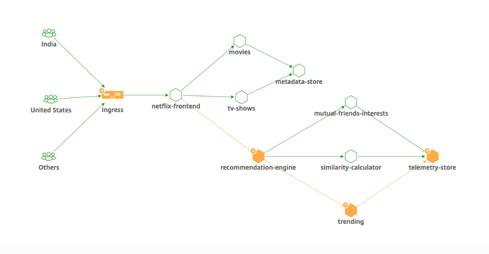
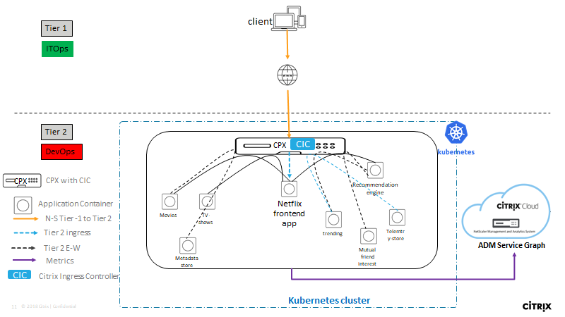
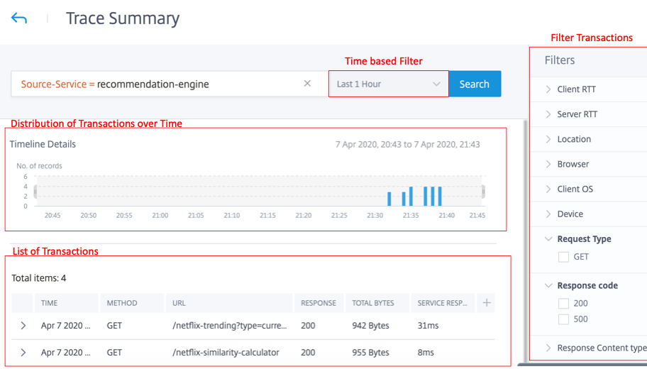
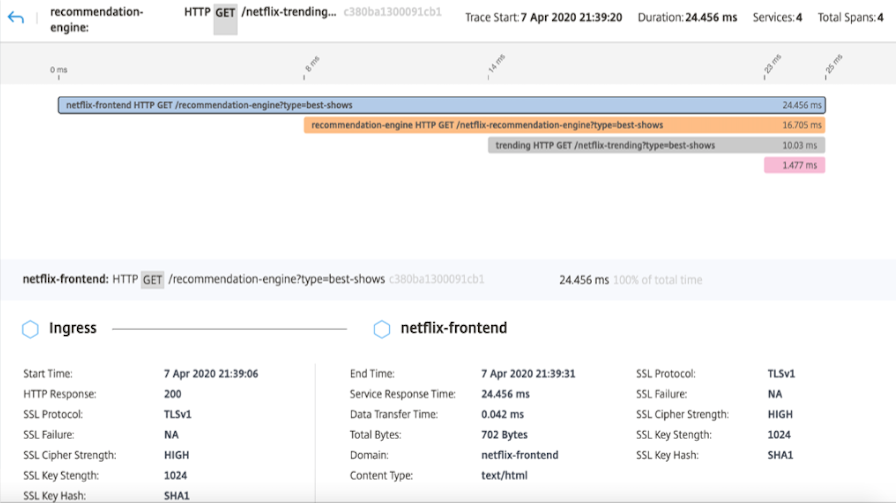

# Citrix ADM Service Graph Distributed Tracing
Visualize the request flow between different microservices using Citrix ADM ! 

This microservice application, which was mainly developed to showcase use cases of Citrix ADM Distributed Tracing, is a dummy Netflix application which allows users to see list of movies, tv shows and makes recommendation based on factors like friends interests, similar shows & trends.



## Use cases of Distributed Tracing
* Helps in Performance RCA to understand which service is consuming most time for a given end-user request.
* Helps in reproducing issues as it gives visibility into the entire trace. Such issues would be otherwise difficut to reproduce.
* Can reduce inter-team dependencies when issues arise as the root service causing issues can be immediately found out.
* Helps Admins in understanding the behaviour of the entire application as a whole.

## Topology used


## Pre-requisites
1. An ADM Agent
2. A Kubernetes Cluster

## Steps

* Step 1: Register your ADM Agent to the ADM setup ( either cloud or on-prem setup)
* Step 2: Deploy the application on the cluser
    * Step 2.1: Clone this repo
      ```
      git clone https://github.com/danny311296/citrix-service-graph-tracing
      cd citrix-service-graph-tracing
      ```
    * Step 2.2: Update the cpx.yaml with Agent IP in "LOGSTREAM_COLLECTOR_IP" and "NS_LOGPROXY" enviroment variable & Agent Fingerprint in "NS_MGMT_FINGER_PRINT"
    
    * Step 2.3: Run
      ```
      kubectl create -f cpx.yaml
      kubectl create -f ingress.yaml
      kubectl create -f netflix.yaml
      ```
* Step 3: Add cluster from ADM GUI. License cs vservers of the CPX.

* Step 4:
Send traffic
```
    curl http://<CPX-IP>/tv-shows -H "Host: netflix-frontend-service"
    curl http://<CPX-IP>/movies -H "Host: netflix-frontend-service"
    curl http://<CPX-IP>/recommendation-engine?type=trending -H "Host: netflix-frontend-service"
    curl http://<CPX-IP>/recommendation-engine?type=similar-shows -H "Host: netflix-frontend-service"
    curl http://<CPX-IP>/recommendation-engine?type=mutual-friends-interests -H "Host: netflix-frontend-service" 
    curl http://<CPX-IP>/recommendation-engine?type=best-shows -H "Host: netflix-frontend-service"
  ```

## Details of Traces

On selecting “Trace Info” on any of the service graph node (say recommendation-engine), you can see all the transactions (aka spans) that the selected service has taken part in for a selected duration. 



On Drilling down on each transaction span by clicking the arrow in each row, you’ll see the details of the trace corresponding to that span transaction, including - Number of Spans & Unique Services taking part in that trace,  List of services taking part in that trace and Time along with percentage spent in each service, Number of errors from every service & Client-side metrics of that transaction – Start Time, End Time & various SSL client metrics.


A user can select “See Trace Details” to visualize the entire trace in the form of a chart of all transactions which are part of the trace 



## More Updates will be made to this Readme
